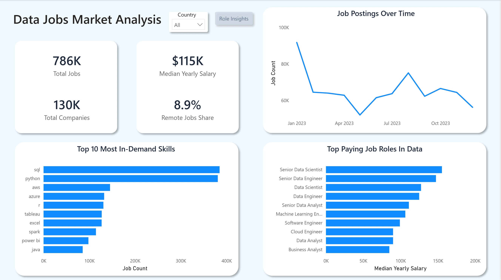
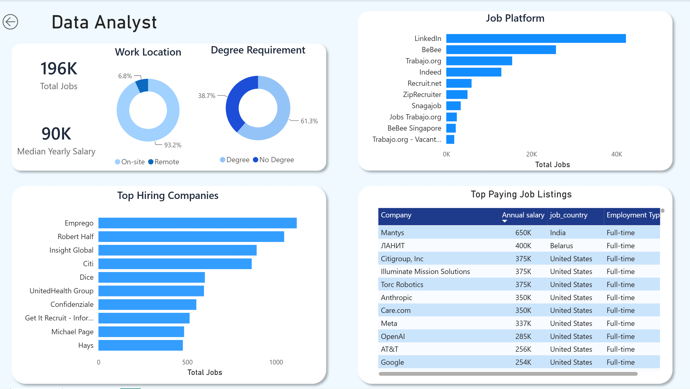

# 📊 Data Jobs Market Analysis

> **End-to-End Data Analytics Project using PostgreSQL and Power BI**

---

## 🚀 Project Highlights

- 📊 Analyzed **786K+** job postings
- 🗄️ PostgreSQL for data analysis
- 📈 Interactive Power BI dashboard
- 📌 DAX measures & KPIs
- 🧹 Power Query transformations

---

## 🖥 Dashboard Preview

### Main Dashboard



### Role Details


---

# 📌 Project Overview

This project analyzes the **2023 Data Jobs Market** using **PostgreSQL** and **Power BI** to uncover hiring trends, salary patterns, remote work opportunities, and the most in-demand technical skills.

Starting with raw job posting data, SQL was used to explore, clean, and answer key business questions. The insights were then transformed into an interactive Power BI dashboard using Power Query and DAX, allowing users to explore the data through dynamic visualizations and drill-through analysis.

This project demonstrates the complete analytics workflow—from querying raw data to delivering business-ready insights through an interactive dashboard.

---

# 📂 Dataset

- **Dataset:** Data Jobs Dataset (2023)
- **Source:** Luke Barousse
- **Database:** PostgreSQL
- **Total Records:** ~786,000 Job Postings

---

# 🎯 Business Questions

This project answers the following questions:

1. Which job roles had the highest hiring demand?
2. Which countries had the highest demand for data professionals?
3. What is the distribution of remote and on-site jobs?
4. Which job roles offered the highest percentage of remote work opportunities?
5. Which job roles had the highest average annual salaries?
6. Which countries offered the highest average salaries for Data Analysts?
7. Which technical skills were most frequently required?
8. Which high-demand technical skills also offered the highest salaries?

---

# 🛠 Technical Skills Demonstrated

## SQL

- Data Profiling
- Data Cleaning
- Filtering (`WHERE`)
- Aggregation (`COUNT`, `AVG`)
- GROUP BY
- ORDER BY
- HAVING
- CASE Statements
- Common Table Expressions (CTEs)
- Scalar Subqueries
- String Functions
- Array Functions (`STRING_TO_ARRAY`, `UNNEST`)

## Power BI

- Power Query
- Data Modeling
- DAX Measures
- KPI Cards
- Interactive Slicers
- Drill-through Navigation
- Dynamic Titles
- Dashboard Design
- Data Visualization

---

# 📊 Power BI Dashboard

The SQL analysis was extended into an interactive Power BI dashboard that enables users to explore the job market dynamically.

### Dashboard Features

- KPI Cards
- Country Slicer
- Drill-through Role Details
- Dynamic Titles
- Job Market Trend Analysis
- Top Hiring Companies
- Top Paying Roles
- Most In-Demand Skills
- Work Location Analysis
- Degree Requirement Analysis

---

# 📈 Dashboard Capabilities

The interactive dashboard allows users to:

- Filter job postings by country.
- Drill through into role-specific insights.
- Compare salaries across different job roles.
- Identify the most in-demand technical skills.
- Explore hiring companies and job platforms.
- Analyze remote work availability.
- Compare degree requirements across job postings.

---

# 📊 Example DAX Measures

The dashboard includes custom measures such as:

- Total Jobs
- Median Yearly Salary
- Remote Jobs Share
- Total Companies

---

# 📈 Key Insights

- Data Analyst, Data Engineer, and Data Scientist account for the majority of job postings.
- SQL and Python consistently appear as the most frequently requested technical skills across data-related roles.
- Senior Data Scientists command the highest median annual salaries.
- LinkedIn contributes the largest share of job postings among all hiring platforms in the dataset.
- Most job postings require a degree, while remote opportunities represent a relatively small proportion of the market.
- Hiring demand varies significantly across countries and job roles.

---

# 📁 Repository Structure

```text
data-jobs-market-analysis/
│
├── data/
│
├── sql/
│   ├── 1_database_setup.sql
│   ├── 2_create_table.sql
│   ├── 3_loading_data.sql
│   ├── 4_data_profiling.sql
│   └── 5_exploratory_data_analysis.sql
│
├── powerbi/
│   ├── Data_Jobs_Market_Analysis_Dashboard.pbix
│   ├── Data_Jobs_Market_Analysis_Report.pdf
│   └── images/
│       ├── dashboard.png
│       └── role_details.png
│
├── python/
│
├── README.md
└── .gitignore
```

---

# 💻 Tools & Technologies

- PostgreSQL
- SQL
- Power BI
- Power Query
- DAX
- Visual Studio Code

---

# 🚀 Future Enhancements

- Perform exploratory data analysis using Python (Pandas, NumPy, Matplotlib, Seaborn).
- Compare hiring trends across multiple years.
- Publish the dashboard using Power BI Service.
- Build predictive models for salary estimation.

---

# 👤 Author

**Anshul Singh**

If you have any feedback or suggestions, feel free to open an issue or connect with me.
